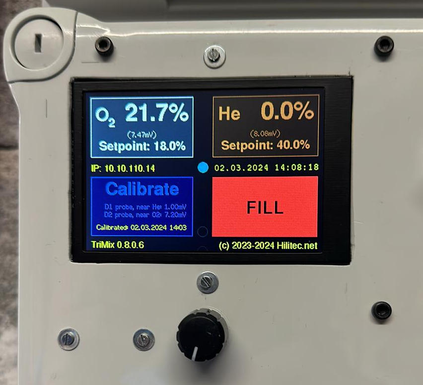
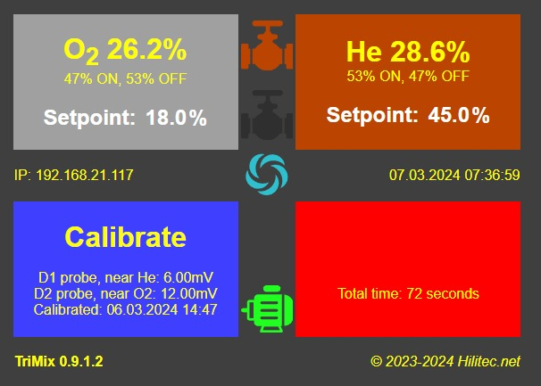

# TriMix
TriMix is an ESP32 based mixer controller for Oxygen (O2) and Helium (He), with TFT display, Wifi connection and Web interface

# ⚠️ SAFETY WARNING AND DISCLAIMER

## This is not a certified device

TriMix is an open-source DIY project. It has **not** been tested, certified, or approved by any regulatory body. It does not meet any industrial, medical, or diving safety standard (EN, ISO, CE, or equivalent).

**Do not rely on this device as your sole means of gas verification.**

---

## Oxygen and Helium are dangerous gases

- **Oxygen** accelerates combustion violently. Enriched oxygen mixtures in contact with hydrocarbons, grease, or oil can cause **fire or explosion**. All equipment used with oxygen-enriched gases must be oxygen-cleaned and oxygen-compatible.
- **Helium** is an asphyxiant in confined spaces. A leak in an enclosed area can displace oxygen and cause **loss of consciousness without warning**.
- **Trimix** is a breathing gas for technical diving. An incorrect mixture can cause **oxygen toxicity, hypoxia, nitrogen narcosis, or death** at depth.

---

## Mandatory precautions

- **Always verify your gas mix** with a certified, calibrated analyzer before any dive — regardless of what this device indicates.
- **Calibrate before every use.** Electrochemical oxygen sensors drift with temperature, pressure, humidity, and age. A calibration that was valid yesterday may not be valid today.
- **Replace sensors according to manufacturer specifications.** The NRC D-05 and similar cells have a limited lifespan. An expired or degraded sensor will give false readings without warning.
- **This device does not measure pressure.** It does not know whether your cylinder is full, empty, or at intermediate pressure. Do not use it as a fill controller without independent pressure monitoring.
- **Never fill unattended.** The automatic valve control is an assistance tool, not a replacement for operator supervision. Stay present during the entire fill process.
- **Ensure all equipment is oxygen-compatible** before use with O2-enriched mixtures. This includes hoses, valves, fittings, and the cylinder itself.

---

## Limitation of the helium measurement

Helium concentration is **calculated**, not directly measured. The calculation is derived from two oxygen sensor readings and assumes that the only gases present are O₂, He, and N₂. Any contamination, sensor drift, or calibration error will directly affect the helium reading. Verify helium content with a dedicated thermal conductivity analyzer when precision is critical.

---

## Limitation of the software

This software is provided **as-is**, without warranty of any kind. It may contain bugs. Sensor readings may be incorrect. Valve control logic may behave unexpectedly. The author accepts no responsibility for any damage, injury, or death resulting from the use or misuse of this software or hardware.

---

## Who should use this device

This project is intended for **experienced technical divers and gas blenders** who:

- Understand the physics and risks of oxygen and helium handling
- Are trained in trimix gas blending procedures
- Have access to certified reference analyzers for verification
- Take full personal responsibility for the gases they produce and breathe

**If you are not sure whether you qualify, you do not qualify.**

---

## Legal

By using this software and building this hardware, you acknowledge that:

1. You use it entirely at your own risk.
2. The author and contributors provide no warranty, express or implied.
3. The author and contributors are not liable for any direct, indirect, incidental, or consequential damages.
4. This device is not a substitute for proper training, certified equipment, and established gas blending procedures.

This project is licensed under the GNU Lesser General Public License (LGPL). See LICENSE for details.

# Hardware
* Microcontroller: ESP32
* Board: ESP32 board with 4 integrated relays, like LC Technology DC5-60V 4 Channel Relay Board (ESP32_Relay_X4)
* Button: Rotary Digital Encoder Push Button (like EC11) for the setup
* Analog converter: I2C ADS1115 4channels analog to digital converter
* Oxygen sensor: NRC D-05
* Display: SPI 3.5" TFT display with ST7796S controller

# Pinouts
* See TriMix_config.h and TriMix_screen.h

# Technical WARNING !
* PIN 12 must NEVER be at Vcc during boot sequence
* ADC2 pins cannot be used when Wi-Fi is used
 
 # Sponsoring
 This package is the result of a *LOT* of work. If you are happy using this package, contact us for a donation to support this project.
 
